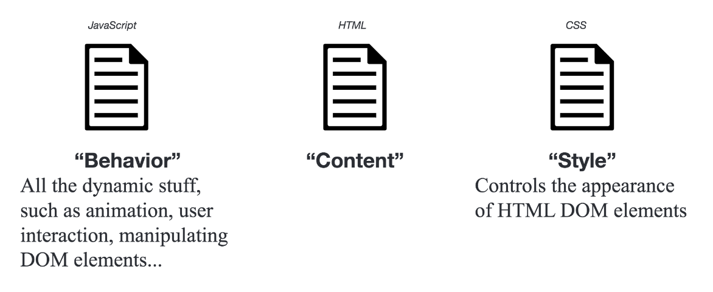

# Web Design 1: A Portfolio Website from Scratch
___

## Getting Ready

Start this week by downloading and unzipping the [workshop materials](http://duspviz.mit.edu/resources/web-design-01.zip) to an appropriate folder. If you want to do this in the terminal, try:

```sh
# Change Directory to Desktop (~ means home)
$ cd ~/Desktop/
# Unzip the archive.
$ unzip web-design-01.zip
# Change directory to the workshop materials.
$ cd web-design-01
# List Files. -f means show file size, -l means long format
$ ls -fl
```

### Use a Text Editor

Code is best written using a text editor capable of highlighting language syntax such as [Atom](https://atom.io), [Visual Studio Code](https://code.visualstudio.com/), or (for the very brave and/or foolhardy) [Emacs](https://www.gnu.org/software/emacs/). To complete the workshop, you will want to do all of your coding one of these editors---at DUSP, we're moving toward supporting the Atom and Visual Studio Code as our primary text editors. If you're using a personal computer and you don't have it installed, feel free to download and install one of these.

### Organize your Workspace

Open your text editor and add your new project folder to your web directory (in Atom File > Add Project Folder; in Visual Studio Code > Add Folder to Workspace). The web directory should be organized in the following manner, though we have yet to create an `index.html` file:


When a browser requests your page, the server will return the `index.html` file in the accessed directory. Create a new blank text document in your text editor and save it as `index.html` in your web folder.

### Start up a Web Server

To work with our website, we need our computer to act like a web server, allowing it to access files online. There are many tools for doing this; a very simple one is accessible from your terminal.

A note on the terminal: it's kind of scary! It's okay to be a little freaked out by the terminal if you're not accustomed to using it. But it's one of the most powerful ways of interacting with your file system, so we'll be using it periodically in DUSPViz sessions. Impress your nerd-friends! Learn the terminal!

If you haven't, use the Terminal to change directory to the folder in which your website files reside. Once there, start a simple Python server. The commands look like this (assuming that you've downloaded the workshop content to your desktop):

```sh
$ cd ~/Desktop/web-design-01/
$ python3 -m http.server 8080
```

Now open a browser and access your site at [http://localhost:8080](http://localhost:8080). ...Very good. A blank browser window. Not too impressive, but this is just fine: we haven't put anything in our HTML file yet!

Your page now appears as it would if it were live on the internet, except it is only visible to you locally---even the most experienced coders would never edit the live version of their websites! It's too easy for fingers to slip and break things. For more on the Python Web Server, see the following[DUSPviz page on localhosts](http://duspviz.mit.edu/tutorials/localhost-servers/).

___

## HTML: The Core Concepts



New coders tend to be slippery with their language and call HTML a 'programming language.' It is not! It is a **markup language,**---one of many (others include [Markdown](https://daringfireball.net/projects/markdown/) and [LaTeX](https://www.latex-project.org/)). Basically, markup languages allow you to structure information in documents. One way to remember this are the acronyms WYSIWYG and WYSIWYM (pronounced 'wizzy-wig' and 'wizzy-wim'). The word processors you're familiar with are WYSIWYG: what you see is what you get. They do not separate form from content, so you're editing your styling even as you're editing your content. Markup languages are WYSIWYM: What You See is What You Mean. They allow you to modify the structure of your document with a great deal of specificity and to separate behavior and style from content (which can be very liberating!).

HTML, standing for [HyperText Markup Language](https://en.wikipedia.org/wiki/HTML), organizes the **content**
of your page by placing it within **elements**.

All HTML documents start with the following line of code:

```html
<!DOCTYPE html>
```

Elements of the page are organized by tags. HTML tags are keywords surrounded by angled brackets. This tag states for the browser that the rest of your file will be written in HTML. The rest of our document will follow a very simple rule, no matter how complex the code. When you write a tag (aka start tag), you will need a second tag that declares the end of that part of the document (aka end tag). Content goes between the start and end tags.


```html
<tag>...</tag>
```

Some tags don't include 'content' in this sense (for example, ``). These are called **void elements** and use a slightly different syntax.

```html
<tag />
```

Comments look like the following. They are used to write human-readable notes in your code, but are ignored by the browser. Comments are great for sharing and revisiting code---it lets other coders (and yourself six months from now) see what you were thinking.

```html
<!-- ... -->
```

A basic page, all together, will look like this. Copy and paste this into your `index.html` document and refresh `localhost`. You should see a header, a paragraph, and an unordered list!

```html
<!DOCTYPE html>
<html lang="en">
	<head>
        <meta charset="utf-8">
        <meta http-equiv="X-UA-Compatible" content="IE=edge">
		<meta name="description" content="">
		<!-- Makes your site display properly on iPhones. -->
        <meta name="viewport" content="width=device-width, initial-scale=1">
        <title>A very exciting page.</title>
	</head>
	<body>
		<!-- This is a comment -->
		<h1>Hello World</h1>
		<div id="main">
            <p>This is text</p>
            <ul>
                <li>List item 1.</li>
                <li><a href="https://dusp.mit.edu"> List item 2.</a></li>
            </ul>
		</div>
	</body>
</html>
```

### The DOM: Document Object Model

Web pages are just long, organized documents. This should be conforting! You've been structuring documents for years now. Every time you decide what content in your paper should be a subheader, where your paragraph breaks should go, which citation style to use, you're building an ad hoc object model for your document. On the web, the [Document Object Model](https://www.w3.org/DOM/) describes the hierarchy of elements in web pages. This is modeled using something commonly called the **DOM Tree**, and it consists of our HTML elements.


### Structural Elements

These elements are large containers for two different types of information: the document's `head` element, or its metadata (`<head></head>`), and the document's `body`, or content (`<body></body>`). Each of these appear once in every html page. The `head` goes above the `body` (which makes sense, yeah?).

#### `<head> Content`

The head of our document looks a like this:

```html
...
<head>
	<meta charset="utf-8">
	<meta http-equiv="X-UA-Compatible" content="IE=edge">
	<meta name="description" content="">
	<!-- Makes your site display properly on iPhones. -->
	<meta name="viewport" content="width=device-width, initial-scale=1">
	<title>A very exciting page.</title>
</head>
...
```

You probably are getting a little freaked out by the block of code sitting between the head tags at the top of your page right now. I know. I am, too. Basically the `head` of your average web documents has continued to get more complicated as the types of devices on which web pages are viewed have diversified.

The important one to note for the time being is the `<title></title>`. If you look at the page (which is being served on your localhost), you should see the content of the title element appearing in the browser tab. This title is not rendered in the page itself; instead it gives the whole document a title, which is indexed by e.g., Google (it'll show up in search results, too). Now let's get to the objects that actually show up in our page: the contents of the `<body>` tag.

### `<body> Content`

The body of our page looks like the below, where I've inserted comments to indicate the function of each line:

```html
<body>
	<!-- h1 is the largest heading. (They range h1-h6.) -->
	<h1>Hello World</h1>
	<!-- a div is a modular container for your page. -->
	<!-- an id uniquely identifies this element for styling or interaction -->
	<div id="main">
		<!-- p is paragraph, and is a slightly offset block of text -->
		<p>This is text</p>
		<!-- ul is an unordered list (there are also ol, ordered lists) -->
		<!-- a class identifies a type of element, allowing the same styling to be applied across many elements-->
		<ul class="list_type">
			<!-- li is list item -->
			<li>List item 1.</li>
			<!-- another list item, this one a link (a), which is hyperlinked to (href) the DUSP page -->
			<li><a href="https://dusp.mit.edu"> List item 2.</a></li>
		</ul>
	</div>
</body>
```

#### `<div> Elements`

Perhaps the most common body element, `div` elements merit a little bit of further discussion. They're both very useful and a little confusing. They're primarily used to construct scaffolding for your content. One page can contain many `div` elements, and one `div` element can contain many nested elements.  These allow you to group content into containers (or divisions) you can organize and style on your web page. They also play nicely with CSS (Cascading Style Sheets). CSS is a style sheet language used for describing the look and formatting of an HTML page; we will introduce it soon...

```html
<div id="main">
	<!-- Content goes here -->
	...
</div>
```

### Tag Attributes, Classes, and IDs

HTML elements are not only their content; they also involve the specification of a number of attributes. These allow you to identify specific elements, modify individual elements and groups of elements, and set the characteristics of the elements.

- *Attributes* define properties of the elements. Elements can have multiple attributes. For example, if the element is a link, where does the link take you (the href attribute)? 
- *Classes* identify a group of elements that operate similarly or work in the same fashion. For example, a button.
- *IDs* identify unique features and allow for and operations to be performed on that unique feature. In each document, each ID should be unique.

Let's take a simple example: a navigation section of a webpage with two buttons that take the user to Github and Places Journal, respectively.

```html
<!-- A div with a blue background with the class naviation, with the unique id main. -->
<div style="background-color:#0000FF" class="navigation" id="main">
	<!-- A link of class button with the unique id git_pointer that will take the user to Github. -->
	<a href="https://www.github.com" class="button" id="git_pointer">Take me to Github.</a>
	<!-- A link of class button with the id places_pointer that will take the user to Places Journal. -->
	<a href="https://placesjournal.org/" class="button" id="places_pointer">Take me to Places Journal.</a>
</div>
```

Remember: ids are unique. Classes identify groups. Attributes tell us about the behavior or style of a given element.
___

## Modify your Document

Now that we are beginning to understand how HTML documents work and the ingredients that make them up, let's modify our web page and insert some content!

### Add Text

Modify the HTML code on the page to include the following. Add some paragraph (`<p></p>`) elements and at least one heading (`<h1></h1>`, `<h2></h2>`, etc.) within the `<div></div>` elements on your page. Of course, you don't need to write any content... do what all designers do and use some [lorem ipsum](https://lipsum.com/) until you know a bit more about the content that meets the needs of this particular site. The `<h1>` tag is one of a series of heading tags ranging from `<h1>` to `<h6>`; use these as you would use heading and subheadings to structure any document. The `<p>` tag signifies a paragraph that can contain large blocks of text. [Read more about HTML page elements](https://www.w3schools.com/tags/).

### Add another Link

Adding a link to your site is simple. To add a link, we use the `<a>` tag. The a tag defines a hyperlink that can be used to link from one page to another. HTML tags can have attributes. Attributes define and provide additional information about an element. To create a hyperlink, we use the href attribute of the a tag. 

You have many options for links. [Read about them here](http://www.w3schools.com/tags/tag_a.asp). For example, if you want a link to open in a new page, you can use `target="_blank"` as a property of the `<a>` tag - this is very common, though becoming less so as more and more users access web pages through their browsers.

*Can you add a link that takes you to Google Maps?*

### Add an Image

Adding an image is just as easy as adding a hyperlink, although a bit different. An image is not stored on your webpage, but it sits on your server, just like your other files. When you display an image in an html file, you are linking to the image. The HTML tells the browser to locate and display it. Therefore, we will follow a multiple step process.

- Locate the folder named `images` in your project directory. You will find one image here named `cat.jpg`. Here you store all subsequent images you want to use in your page.
- Use the `` tag to link to that image in `index.html`.

Now we can add the image to our index.html. The following line of code uses the `` tag, and then links to our image. We will use the `src` attribute to name the source of the image. The image is coming from our own server, we don't need to go anywhere to find it, so we can put the name of the folder and image as our image address (i.e., `"images/cat.jpg"`)

Can you add another image, perhaps a photo of the Boston skyline?

If you want to add an image from another page, you can simply include the URL at which the image is located. The following links to an image on Wikimedia.

```xml

```

#### Our Code

At present, your document will look something like the following.

```xml
<!DOCTYPE html>
<html lang="en">
	<head>
    	<meta charset="utf-8">
    	<title>Hello World</title>
	</head>
	<body>
		<!-- This is a comment -->
		<h1>Hello World</h1>
		<div id="main">
			<p id="foo">This is my first paragraph.</p>
			<p id="bar">This is my second paragraph. <a href="http://dusp.mit.edu">Take me to DUSP.</a></p>
			
		</div>
	</body>
</html>
```

Our page, with this code, contains a bit more content now.


*What does our DOM Tree look like at this point?*

___

## CSS: Cascading Style Sheets

Cascading Style Sheets (CSS) is a so-called stylesheet language used to formally define the look and formatting of an HTML page. It uses the DOM and styles 'cascade' from higher elements in the DOM tree to elements further down.

We are going to be using CSS3, which is the third iteration of the CSS styling language. CSS is a very useful styling system, and allows you to style items on your page according to a number of methods based on the element it falls within (ie div, body, p, etc), the id of the element, or the class of the element.

### 'Cascading...?'

The language 'cascades' in the sense that if you style an element, any elements falling below that element in the DOM will get the same styling _unless you specify otherwise_. For example, if you set the font for `<body>` element, a `<p>` element will also be set to the same font, unless you specify in the CSS that you want that `<p>` element (or perhaps a class of `<p>` elements) to have another font. This is a useful in that is minimizes the code you need to write and forces you to be careful with your page organization.

### Link a CSS File to your Site

CSS can be added to style your website a few different ways. You can apply CSS to individual elements, embed it within your HTML document, or create a separate CSS file and link it to your HTML document. The latter is the cleanest method, and is the method most commonly used by websites in production. In your file, add the following link between the `<head>` tags of your `index.html` file.

```html
<link href="css/main.css" rel="stylesheet" />
```

Note that `<link>` elements are different from `<a>` elements, even though both are commonly referred to as 'links'. The `<link>` element imports an external file into your html document, while the `<a>` element places a link to a page or resource within the body of your site.

Save your document, and refresh your page. Everything should center. This is because we applied CSS code to our document by linking to our style file.

In the materials for this week, locate the file `main.css`. This is our stylesheet. Open this in your text editor to view the contents. It is a very simple bit of CSS that tells a browser to center everything in the `<body>` element on the page.

```css
body {
	text-align: center;
}
```

### Basic Syntax

Basic CSS syntax looks like the following.

```css
[selector] {
	[property]: [value];
}
```

Selectors refer to specific tags, ids, titles, classes, etc. in our HTML. For example, if we want to style everything that falls in the `<body>` tag, we use the `<body>` selector as above.

Selectors can be specified by element...

```css
p {
	font-size: 12;
}
```

...by class...

```css
.main {
	font-size: 12;
}
```

or by ID...

```css
#main {
	font-size: 12;
}
```

Note that all have slightly different syntax! Elements are invoked using the name of the element. Classes are invoked by use of a period prefix (`.classname`). IDs are specified with an [octothorpe](https://en.wiktionary.org/wiki/octothorpe) or hash mark (`#`). Recall (repeat after me) that classes are groups of elements and the IDs are unique!

### Inheritance and Order of Operations

CSS follows the DOM model, with styles applied to elements higher in the DOM applied to those that are descendants. If selectors are defined in multiple locations in your CSS, which one gets precedence?


There are two general rules of thumb.

* CSS defined last in your document will supersede CSS set on a selector earlier in your document. E.g.,...

```css
p {
	color: red;
}

/* will be superceded by... */

p {
	color: blue;
}

```

* The more specific selector will override the less specific selector. For example, a style set on the body selector will be overridden by a style set on an element within the body... or a style set on a specific class of a paragraph element will override the generic paragraph style. E.g., ...

```css
p {
	font-size: 12;
}

/* will be supercede by... */

p .footnote {
	font-size: 9;
}
```


### Properties and Values

There are hundreds of properties you can set using CSS. Some of these include font, color, location on page, opacity, size, etc. An extensive list can be found in CSS reference documents, for example [those made available by w3schools](https://www.w3schools.com/cssref/default.asp).

However, we'll cover some of the most common here.

#### Font and Type Size

To change the font for an entire document, we use the highest-level DOM element we can - the `html` selector. 

```css
html {
  font-family: Helvetica, Arial, sans-serif;
  font-size: 24px;
  line-height: 32px;
}
```

`font-family` is a list of priorities. In the case of the above, the browser checks to see if the user has access to the Helvetica font; if not, Arial is substituted; if even Arial is not found (an unlikely scenario) the system's default [sans-serif font](https://en.wikipedia.org/wiki/Sans-serif) is used. Line height specifies the minimal height of lines within the element.

#### Background Color

The color of an entire element can be modified by using the `background-color` property.

```css
p {
  background-color: #dddddd;
}
```

Colors can specified using hex (like the above, `#dddddd`), RGBA (`rgba(221, 221, 221, 1)`), or a set of [preset supported color names](http://www.w3schools.com/colors/colors_names.asp).

#### Pseudo-Classes

Imagine we have a link color like the following:

```css
a {
  color: orange;
}
```

This `a` element itself has what are called [Pseudo-Classes](https://developer.mozilla.org/en-US/docs/Web/CSS/Pseudo-classes). Pseudo-classes are keywords added to selectors that specifies a special state of the element to be selected. We signify a pseudo-class using a **:**. For example, one pseudo-class is hover, and it signifies what happens you hover over an element. This can be used to change the color a link turns when you hover over it.

```css
a:hover {
  color: orange;
}
```

## The Box Model: A Love Story

HTML and CSS love boxes. Love, *love*, ***love*** boxes. In fact, they loves boxes so much that they puts all of your elements in them. They love having elements in boxes so much that it runs off to tell web browsers about the boxes and how the elements are positioned in the boxes, which means it needs a language to describe them. This is good for us: this box language allows us to be very specific about how elements relate to each other... and their boxes.


- **Padding**: The content is surrounded by the padding area, which sits between the content and the border.

- **Border**: Every box has a border that exists on the outer edge of the padding area.

- **Margin**: Margin defines the distance between the element and neighboring elements. Margin never has color.

- **Dimensions**: Controls the height and width of the elements.

You can also adjust the margins, padding, and border individually on each side of the element. And example element, along with its styling, is below. Add this to your CSS stylesheet and save to see how it changes our basic webpage.

```css
p {
    background-color: #dddddd;
    padding: 20px;
    width: 320px;
    height: 40px;
    margin-right: 10px;
}
```

#### Positioning

Positioning your element

* **Relative** - Position according to normal document flow, then shift using positioning properties such as *top* or *left*.

* **Absolute** - Take out of normal flow, and manually position against the containing element.

* **Fixed** - Take out of normal flow and manually position against the browser window.

Another available property is called is **float**. Float can be used to wrap text around images.

CSS is the way you style your page, learn more by referring to the references, or playing around in a sandbox such as [CSS Desk](http://www.cssdesk.com/).

---

## What to do next?

Add more images, more text, and different elements to your `index.html`! Consider exploring HTML and CSS resources on offer from Lynda.com, Codecademy, and w3schools. See if you can understand and expand the [basic website template](http://duspviz.mit.edu/resources/gis-portfolio.zip) we provide students in the first week of 11.205 - try adding content and changing styles! Play with hosting your website on your Athena locker. If you're feeling bold, dip your toes into Javascript.

Come back next week for a primer on using Bootstrap and templates to make developing stylish---oh-so-stylish---and function---oh-so-functional---websites painless.


