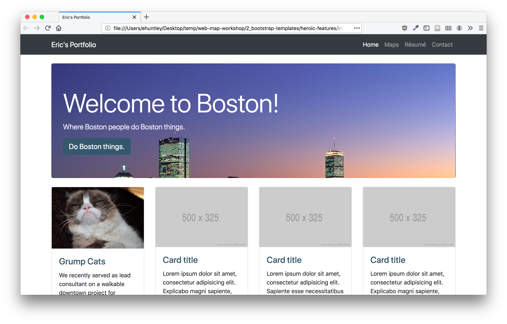
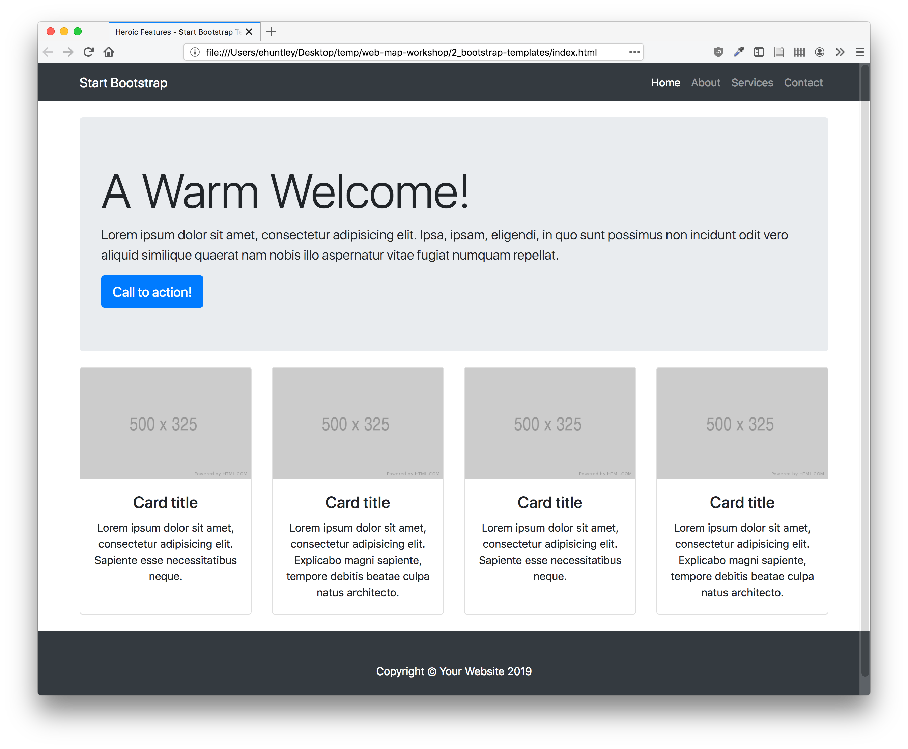
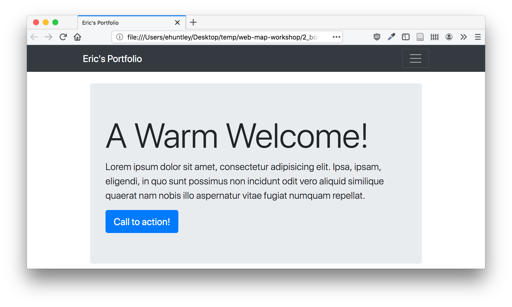
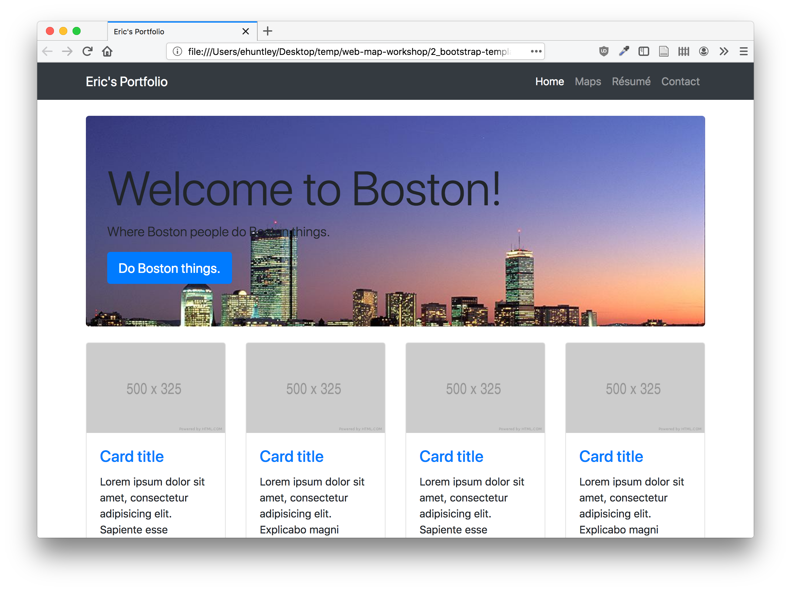
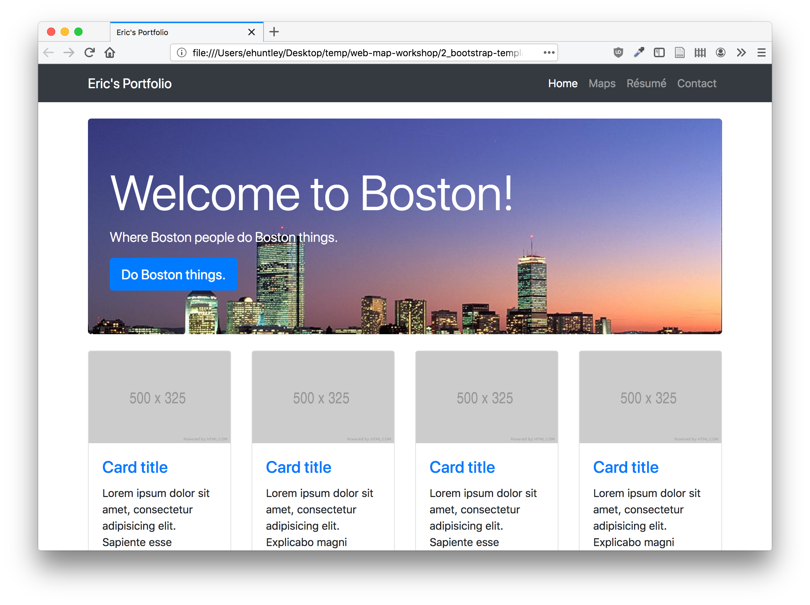

# Web Design 2: Website Frameworks and Templates



[Download workshop materials here.](http://duspviz.mit.edu/resources/heroic-features.zip)

The goal of this workshop is to get you hacking at existing templates built using [a framework called Bootstrap](https://getbootstrap.com/). This will involve customizing a pre-existing template by replacing placeholder content with our own material and developing custom CSS. At the end of the lab, you will have the skeleton of an easily expandable, mobile-friendly portfolio page.

## Templates and Frameworks

When developing for the web, you should not think that you're reinventing the wheel! Usually, there will be a template out there to get you started, many of which are free and open source. Many of these will use _frameworks_, which provide the code for common components and tasks.

## The Bootstrap Framework

The framework we are going to focus on today is called Bootstrap. Bootstrap is an exceedingly popular and relatively lightweight website framework built with HTML, CSS, and Javascript. Again, Bootstrap is a _framework_: this means that most page elements, common functions, and foundational components are already created for you to use and customize. The components can be customized using HTML, CSS (for styling), and Javascript (for functionality, i.e., what happens when you click on something). Bootstrap was developed by Twitter, and is one of the most common frameworks for websites on the web today.  [We encourage you to consult the documentation for a more complete treatment](https://getbootstrap.com/docs/4.3/getting-started/introduction/).

Why are we focusing on Bootstrap? One of the key reasons is that Bootstrap is designed to be mobile-friendly, meaning your site will dynamically resize to be viewable on mobile devices. Another is that Bootstrap has an excellent grid system that allows us a nice ability to layout our site into columns and divisions. The grid system makes extensive use of `<div></div>` elements (remember, these are scaffolding for our page structure) to arrange our page content into rows and columns. [More on the grid system is here](https://getbootstrap.com/docs/4.3/layout/grid/).

The components provided by the Bootstrap framework and templates are on the Bootstrap components site. Tables, dropdown menus, panels, and dividers, oh my!. Don't worry if this is confusing or there are words you don't understand: we are just getting started.

## Download a Bootstrap Template

Today we are going to use a StartBootstrap template called [Heroic Features](https://startbootstrap.com/templates/heroic-features/). The template looks like the following, which will be great for our site.



## An Overview of Provided Materials

In the materials package, you will find the following folders and files. Keep them all in the same directory.

+ css: Folder a custom stylesheet for our site.
+ images: Folder containing images for our site.
+ index.html: Our template index.html. Use this for the tutorial.
+ LICENSE: The use license for the Heroic Features template. Note that it's licensed for free distribution, modification, and reuse under a very permissive [MIT License](https://en.wikipedia.org/wiki/MIT_License). Note that this is all conditional on my distributing the LICENSE notices with the redistributed files. We're being a good steward of open source materials! You should do the same.

Open `index.html` in a web browser and observe our template in action! While you're at it, resize your browser, scroll up and down, and mouseover some objects... you'll see that there's already quite a lot of magic happening without our having customized the template at all!

## View the Code

To investigate further, open up the `index.html` file in Atom, Visual Code (or your text editor of choice). This should be at least a little familiar: it's an HTML file, with tags, elements, style, and various links to other components. Notice the `<head>`, `<body>`, ``, and `<div>` tags, among others.

```html
<!DOCTYPE html>
<html lang="en">

<head>
  <meta charset="utf-8">
  <meta name="viewport" content="width=device-width, initial-scale=1, shrink-to-fit=no">
  <meta name="description" content="">
  <meta name="author" content="">

  <title>Heroic Features - Start Bootstrap Template</title>

  <!-- Bootstrap core CSS -->
  <link href="https://stackpath.bootstrapcdn.com/bootstrap/4.3.1/css/bootstrap.min.css" rel="stylesheet" >

  <!-- Custom styles for this template -->
  <link href="css/heroic-features.css" rel="stylesheet">
</head>

<body>

  <!-- Navigation -->
  <nav class="navbar navbar-expand-lg navbar-dark bg-dark fixed-top">
    <div class="container">
      <a class="navbar-brand" href="#">Start Bootstrap</a>
      <button class="navbar-toggler" type="button" data-toggle="collapse" data-target="#navbarResponsive" aria-controls="navbarResponsive" aria-expanded="false" aria-label="Toggle navigation">
        <span class="navbar-toggler-icon"></span>
      </button>
      <div class="collapse navbar-collapse" id="navbarResponsive">
        <ul class="navbar-nav ml-auto">
          <li class="nav-item active">
            <a class="nav-link" href="#">Home
              <span class="sr-only">(current)</span>
            </a>
          </li>
          <li class="nav-item">
            <a class="nav-link" href="#">About</a>
          </li>
          <li class="nav-item">
            <a class="nav-link" href="#">Services</a>
          </li>
          <li class="nav-item">
            <a class="nav-link" href="#">Contact</a>
          </li>
        </ul>
      </div>
    </div>
  </nav>

  <!-- Page Content -->
  <div class="container">

    <!-- Jumbotron Header -->
    <header class="jumbotron my-4">
      <h1 class="display-3">A Warm Welcome!</h1>
      <p class="lead">Lorem ipsum dolor sit amet, consectetur adipisicing elit. Ipsa, ipsam, eligendi, in quo sunt possimus non incidunt odit vero aliquid similique quaerat nam nobis illo aspernatur vitae fugiat numquam repellat.</p>
      <a href="#" class="btn btn-primary btn-lg">Call to action!</a>
    </header>

    <!-- Page Features -->
    <div class="row">

      <div class="col-lg-3 col-md-6 mb-4">
        <div class="card h-100">
          
          <div class="card-body">
            <h4 class="card-title"><a href="#">Card title</a></h4>
            <p class="card-text">Lorem ipsum dolor sit amet, consectetur adipisicing elit. Sapiente esse necessitatibus neque.</p>
          </div>
        </div>
      </div>

      <div class="col-lg-3 col-md-6 mb-4">
        <div class="card h-100">
          
          <div class="card-body">
            <h4 class="card-title"><a href="#">Card title</a></h4>
            <p class="card-text">Lorem ipsum dolor sit amet, consectetur adipisicing elit. Explicabo magni sapiente, tempore debitis beatae culpa natus architecto.</p>
          </div>
        </div>
      </div>

      <div class="col-lg-3 col-md-6 mb-4">
        <div class="card h-100">
          
          <div class="card-body">
            <h4 class="card-title"><a href="#">Card title</a></h4>
            <p class="card-text">Lorem ipsum dolor sit amet, consectetur adipisicing elit. Sapiente esse necessitatibus neque.</p>
          </div>
        </div>
      </div>

      <div class="col-lg-3 col-md-6 mb-4">
        <div class="card h-100">
          
          <div class="card-body">
            <h4 class="card-title"><a href="#">Card title</a></h4>
            <p class="card-text">Lorem ipsum dolor sit amet, consectetur adipisicing elit. Explicabo magni sapiente, tempore debitis beatae culpa natus architecto.</p>
          </div>
        </div>
      </div>

    </div>
    <!-- /.row -->

  </div>
  <!-- /.container -->

  <!-- Footer -->
  <footer class="py-5 bg-dark">
    <div class="container">
      <p class="m-0 text-center text-white">Copyright &copy; Your Website 2019</p>
    </div>
    <!-- /.container -->
  </footer>

  <!-- Bootstrap core JavaScript -->
  <script src="https://code.jquery.com/jquery-3.3.1.slim.min.js"></script>
  <script src="https://stackpath.bootstrapcdn.com/bootstrap/4.3.1/js/bootstrap.min.js"></script>

</body>

</html>
```

## So... where's this 'Bootstrap' you speak of?

Good question! Our page is loading the Bootstrap template in a few places. First, in the `<head></head>`, it loads our stylesheets here:

```html
  <!-- Bootstrap core CSS -->
  <link href="https://stackpath.bootstrapcdn.com/bootstrap/4.3.1/css/bootstrap.min.css" rel="stylesheet" >

  <!-- Custom styles for this template -->
  <link href="css/heroic-features.css" rel="stylesheet">
```

You'll probably notice that these `<link>`s are going different places; one is pulling Bootstrap's default styles from the Bootstrap CDN (content delivery network). The other is pulling some css from our local environment, namely the `css` subdirectory. This makes sense! Bootstrap is a framework that powers (actually) tens of millions of websites. The local `.css` file is the customizations and overrides that we're piling on top of the Bootstrap defaults.

So that accounts for styles; what about behaviors? You'll find that the page is loading in a couple of JavaScript files at the bottom of the `<body></body>`:

```html
<script src="https://code.jquery.com/jquery-3.3.1.slim.min.js"></script>
<script src="https://stackpath.bootstrapcdn.com/bootstrap/4.3.1/js/bootstrap.min.js"></script>
```

jQuery is a JavaScript library on which Bootstrap (and many, many other web applications) depend. Again, these are 'stock' Bootstrap, so we're going to save ourselves some effort and pull them from the jQuery and Bootstrap servers respectively.

Now that we've seen where our page is getting its Bootstrap powers, let's set to modifying the page for our own purposes!

## Edit our Template

First, let's customize the page content, which is structured by our HTML code. Customizing our HTML involves running through our code and getting a feel for its structure. Scan through and note the `<head>` section, `<body>` section, and various elements on the page that we've seen before. Note where the rows of images appear in our code (`<div class="row">`), along with the navigation bar (`<nav class="navbar navbar-expand-lg navbar-dark bg-dark fixed-top">...</div>`), and the various headings and paragraph tags. Lets modify some of the following to include our content. We have three images in our images folder in the materials we would like to turn into the first row of our portfolio, and we can get rid of the rest of the rows.

### Change the Page Title

Locate the `<title></title>` element within the head part of your page. Change this to state that it is your portfolio (e.g., "Eric's Portfolio").

```html
<title>Eric's Portfolio</title>
```

As a reminder, as part of the page metadata, this information does not render in the webpage. Instead, it lets the browser (and search engines) know what your page is called. To actually change your page, you'll have to modify text in the `<body></body>` section: in other words, those elements that render in the webpage.

### Change the Navbar

At the start of our `<body></body>`, you should see the navbar after the `<!-- Navigation -->` comment. Bootstrap provides a pretty feature-rich navbar, which is [documented here](https://getbootstrap.com/docs/4.3/components/navbar/). Check out the documentation; you'll see that it supports a lot of different sub-components, like forms, toggles, and dropdown menus. It also collapses into a familiar hamburger-esque icon indicating a drop-down menu on small screens. Here, locate the `<div>` with class `navbar-brand`, it will look like the following, and change it from Start Bootstrap to a title of your choice, e.g.,

```html
<a class="navbar-brand" href="#">Eric's Portfolio</a>
```

There are a handful of navigation links in our header (About, Services, and Contact) in a div with `id="navbarResponsive"`. We can change these too! Eventually, we'll want to link to other pages on our site that contain this content. The block looks like the following. I changed mine to say Maps, Résumé, and Contact.

```html
<div class="collapse navbar-collapse" id="navbarResponsive">
    <ul class="navbar-nav ml-auto">
        <li class="nav-item active">
            <a class="nav-link" href="#">Home
                <span class="sr-only">(current)</span>
            </a>
        </li>
        <li class="nav-item">
            <a class="nav-link" href="#">Maps</a>
        </li>
        <li class="nav-item">
            <a class="nav-link" href="#">Résumé</a>
        </li>
        <li class="nav-item">
            <a class="nav-link" href="#">Contact</a>
        </li>
    </ul>
</div>
```

Nice. Refresh the page in your web browser; you should see your changes reflected!



### Modify the Jumbotron

The content of our page really begins at the `<!-- Page Content -->` comment, which includes a `container` (i.e., a `<div class="container"`). A container is a prerequisite for using the Bootstrap grid system: it basically sets up the outer bounds of the grid.

Within this container, you'll see five basic 'chunks'; each is just a copy of the previous. You'll see one so-called [Jumbotron](https://getbootstrap.com/docs/4.3/components/jumbotron/) that showcases featured content with a full-width element. It's structured like this:

```html
<header class="jumbotron my-4">
    ...      
</header>
```

You'll also see four `card`s in columns, which are set up like this:

```html
<div class="col-lg-3 col-md-6 mb-4">
    <div class="card h-100">
        ...
    </div>
</div>
```

These are standard Bootstrap modules which illustrate why we love Bootstrap. We can look through [the available components](https://getbootstrap.com/docs/4.3/components/alerts/) and usually find an implementation of the functionality we need.

Let's modify the jumbotron. Obviously, you can use your own content, but let's say we're very enthusiastic about Boston (and Boston things). We'll modify the heading (`<h1>`), the (`<p>`), and the hyperlink button (`<a class="btn btn-primary btn-lg">`).

```html
<!-- Jumbotron Header -->
<header class="jumbotron my-4">
    <h1 class="display-3">Welcome to Boston!</h1>
    <p class="lead">Where Boston people do Boston things.</p>
    <a href="#" class="btn btn-primary btn-lg">Do Boston things.</a>
</header>
```

But you'll notice that there is no image taking up that big empty space behind our text. It's pretty conventional in contemporary web development to use this space for an eye-catching image... so let's do that!

We're going to do this by creating a background for our `<header>` element. First, create a new file called `custom.css` and store it in the `css` folder of your webpage. We'll then add it to our `index.html` file, just below the line that links `heroic-features.css`:

```html
<!-- Custom styles for this template -->
<link href="css/heroic-features.css" rel="stylesheet">
<link href="css/custom.css" rel="stylesheet">
```

Next, add an `id` to your header to uniquely identify it so that we can style it (and it alone).

```html
<header class="jumbotron my-4" id="featured">
    ...
</header>
```

Now, in your css file, we're going to create a new CSS selector which selects the element of id `featured` and gives it a background image.

```css
#featured {
    background-image: url("../images/boston.jpg");
    background-size: cover;
}
```

The hashtag (or octothorpe) means that we're looking for a specific `id`, in this case `featured`. The `background-image` property loads and image and places it in the background of a given element. We ask it to go the url that is up one directory (`..`), then in the images folder, where we've stored `boston.jpg`. This path is relative to the css file.

Reload your page. If everything has gone well, you should see this:



Okay, but those title ares little hard to read now. Let's change the font color using the same CSS selector.

```css
#featured {
    background-image: url("../images/boston.jpg");
    background-size: cover;
    color: white;
}
```

Better!



### Modify a Card

Now we're going to modify one of the existing cards. We've recently completed a project with Grumpy Cat, Co. and we'd like to advertise this fact. We'll do this by modifying the first card on our page.

```html
<div class="col-lg-3 col-md-6 mb-4">
  <div class="card h-100">
    
    <div class="card-body">
      <h4 class="card-title"><a href="#">Grump Cats</a></h4>
      <p class="card-text">We recently served as lead consultant on a walkable downtown project for Grumpy Cats which won a APA Grumping in Place Award.</p>
    </div>
  </div>
</div>
```

Take note of the first div excerpted above, particularly its classes. Bootstrap is built on a 12-wide grid. Elements are given a certain amount of horizontal space (i.e., they are in columns), which are specified using classes. The first two classes in the div above (`col-lg-3` and `col-md-6`) are Bootstrap-specific ways of saying: on large screens, this card should take up 25 percent of available horizontal space (3 out of 12). On medium screens (and smaller) it should take up 50 percent of available space (6 out of 12).

Finally, let's say we want to modify the link color; that blue is a bit---shall we say---much. We're going to use `rgb()` to set the colors.

```css
a {
	color: rgb(52, 87, 109);
}

a:hover {
	color: rgb(51, 51, 51);
}
```

We're introducing a few things here; first is the rgb() function which specifies a color using rgb codes (where the digits are red, blue, and green respectively and out of 255). We're also introducing the `:hover` pseudo-class, which specifies a specific state. We're giving a style for `a` hyperlinks when the mouse hovers over them.

Refresh your page! You should see that your links are now a different color, though your button is not. This might be a bit mystifying: the button is just an `a` with a specific `class`. But a page is styled according to the most specific selector, so the Bootstrap CSS's style for `btn-primary` classes will override our straightforward `a`. So let's use a `class` selector with a `.` prefix to provide a background color for our button (we also remove its border).

```css
.btn-primary {
    background-color: rgb(52, 87, 109);
    border: none;
}

.btn-primary:hover {
    background-color: rgb(51, 51, 51);
}
```


Save and refresh your page. You should now see the button color changed to match your link color.

### What Now?

We've covered a lot today! For an additional challenge, you can go ahead and...

+ Modify the additional Bootstrap cards using your own content. 
+ Experiment with your css; try modifying the font of the entire document, and/or of specific elements.
+ Develop a new page, maybe using the [Blog Post](https://startbootstrap.com/templates/blog-post/) template and link it to your front page.